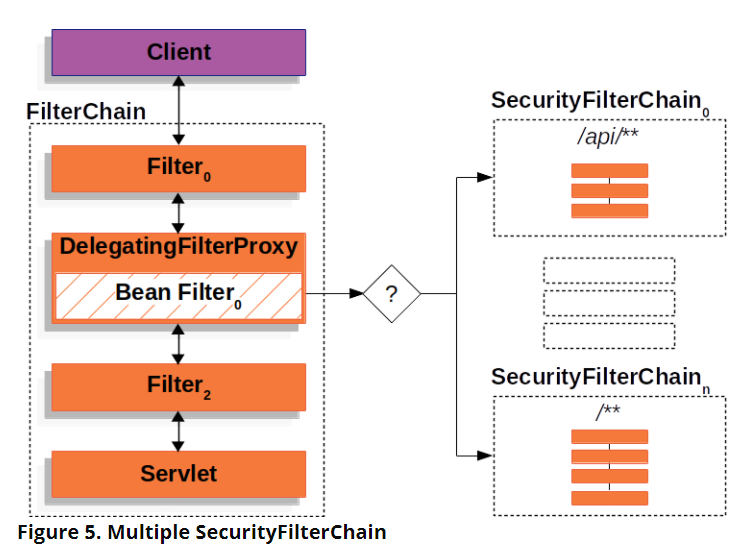
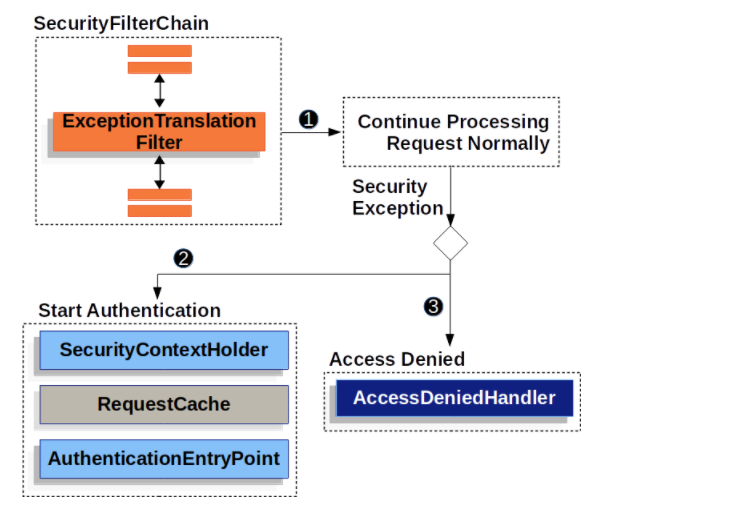

## Filter
Spring security是基於Filter設計的，因此了解Filter的原理和目的有助於理解spring security的架構。在servlet container，使用者發出請求時，會創造一個FilterChain的物件，能夠幫忙修飾request、response或是處理請求相關的業務邏輯。

## DelegatingFilterProxy
Servlet container掌管Servlet，而Bean則由spring掌管，因此當創立一個Spring security 的Filter時，需要一個介於Servlet container 和spring ApplicationContext之間的溝通橋梁 -  DelegatingFilterProxy。
將DelegatingFilterProxy註冊在Servlet container下，其負責調用繼承Filter的Bean。


DelegatingFilterProxy使用Proxy pattern，當只有真正要開始使用Filter(Spring Bean)時才真正的初始化，被代理的物件。下方為DelegatingFilterProxy 的source code，delegate是背後真正在執行運算的物件。

```java
@Override
public void doFilter(ServletRequest request, ServletResponse response, FilterChain filterChain)
			throws ServletException, IOException {

		// Lazily initialize the delegate if necessary.
		Filter delegateToUse = this.delegate;
		if (delegateToUse == null) {
			synchronized (this.delegateMonitor) {
				delegateToUse = this.delegate;
				if (delegateToUse == null) {
					WebApplicationContext wac = findWebApplicationContext();
					if (wac == null) {
						throw new IllegalStateException("No WebApplicationContext found: " +
								"no ContextLoaderListener or DispatcherServlet registered?");
					}
					delegateToUse = initDelegate(wac);
				}
				this.delegate = delegateToUse;
			}
		}

		// Let the delegate perform the actual doFilter operation.
		invokeDelegate(delegateToUse, request, response, filterChain);
	}
```

## FilterChainProxy and SecurityFilterChain
FilterChainProxy是Spring security提供的一種Filter，能夠藉由調派SecurityFilterChain，來使用多個Filter物件。FilterChainProxy能決定每一次的request，需要使用哪個SecurityFilterChain物件。Security Filters 都是註冊在FilterChainProxy中，而使用FilterChainProxy的優點如下:
* 提供許多隱藏的服務，例如清理SecurityContext 避免Memory Leaks，或是使用HttpFirewall 來保護應用程式免於攻擊。
* 能夠藉由RequestMatcher 來判斷每個request所需要使用到的Filters，不受限於URL Mapping。

<mark>需要注意的是，FilterChainProxy只會使用第一個符合這次request所需的SecurityFilterChain，而SecurityFilterChain裏頭的Filter數量為0-n個。</mark>

## Security Filters
被SecurityFilterChain API插入到FilterChainProxy裡面。Filters物件的順序很重要，但不用特別去記得Spring Security Filters的順序。若要看詳細的Spring Security Filters類別和順序，可以直接到官方的文件搜尋。
<mark>**其中重要的spring security filter 為(依照順序由上到下):**</mark>
* SecurityContextPersistenceFilter (restores Authentication from JSESSIONID)
* UsernamePasswordAuthenticationFilter (performs authentication)
* ExceptionTranslationFilter (catch security exceptions from FilterSecurityInterceptor)
* FilterSecurityInterceptor (may throw authentication and authorization exceptions)

參考網址: https://stackoverflow.com/questions/41480102/how-spring-security-filter-chain-works


## ExceptionTranslationFilter 
當使用者沒有驗證或是沒有權限卻要求某個資源時，spring security會拋出AuthenticationException或是AccessDeniedException，
ExceptionTranslationFilter 能夠將處理這兩個例外的結果存入到response中，是一種 Security Filter。
ExceptionTranslationFilter也在FilterChain當中，當Exception發生時，會先判斷是哪種Exception，若是AuthenticationException，則會要求使用者驗證，例如可能將使用者重導到登入頁面。

ExceptionTranslationFilter pseudocode
```java
try {
    filterChain.doFilter(request, response);  
} catch (AccessDeniedException | AuthenticationException ex) {
    if (!authenticated || ex instanceof AuthenticationException) {
        startAuthentication(); 
    } else {
        accessDenied(); 
    }
}
```


## AuthenticationEntryPoint
產生用來要求使用者提供credentials的 HTTP response，通常實現是讓使用者重導回登入頁面或是回傳WWW-Authenticate header。


參考資料 : 
https://docs.spring.io/spring-security/site/docs/current/reference/html5/#authz-pre-invocation
https://docs.spring.io/spring-security/site/docs/current/reference/html5/#servlet-authentication

https://docs.spring.io/spring-security/site/docs/current/reference/html5/#servlet-architecture

補充
ExceptionTranslationFilter source code
https://github.com/spring-projects/spring-security/blob/main/web/src/main/java/org/springframework/security/web/access/ExceptionTranslationFilter.java