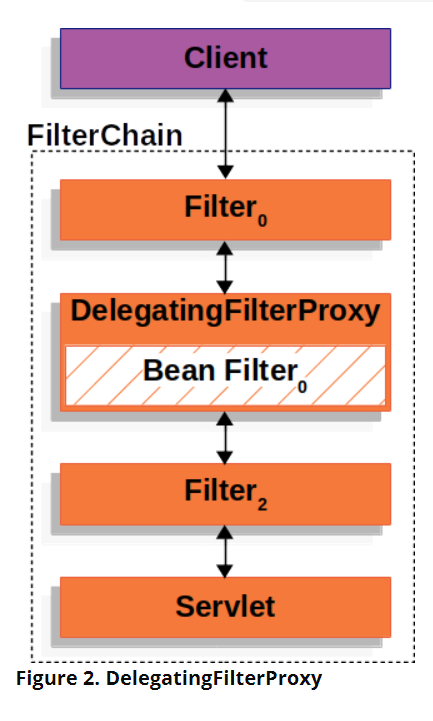

## Filter
Spring security是基於Filter設計的，因此了解Filter的原理和目的有助於理解spring security的架構。在servlet container，使用者發出請求時，會創造一個FilterChain的物件，能夠幫忙修飾request、response或是處理請求相關的業務邏輯。

## DelegatingFilterProxy
Servlet container掌管Servlet，而Bean則由spring掌管，因此當創立一個Spring security 的Filter時，需要一個介於Servlet container 和spring ApplicationContext之間的溝通橋療 -  DelegatingFilterProxy。
將DelegatingFilterProxy註冊在Servlet container下，其負責調用繼承Filter的Bean。

此處補上詳細介紹Spring Security的原理，其大致原理為Filter，會檢查特定的url請求，可以參考spring security官方的文件。
將實際應用寫完後，一定要來補上原理。

參考資料 : https://docs.spring.io/spring-security/site/docs/current/reference/html5/#authz-pre-invocation
https://docs.spring.io/spring-security/site/docs/current/reference/html5/#servlet-authentication

https://docs.spring.io/spring-security/site/docs/current/reference/html5/#servlet-architecture