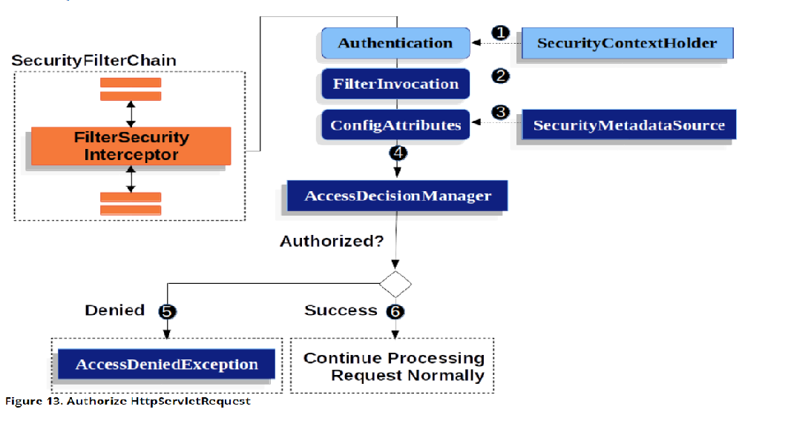

TODO 補上spring security 原理
此處補上詳細介紹Spring Security的原理，其大致原理為Filter，會檢查特定的url請求，可以參考spring security官方的文件。
將實際應用寫完後，一定要來補上原理。

參考資料 : https://docs.spring.io/spring-security/site/docs/current/reference/html5/#authz-pre-invocation
https://docs.spring.io/spring-security/site/docs/current/reference/html5/#servlet-authentication