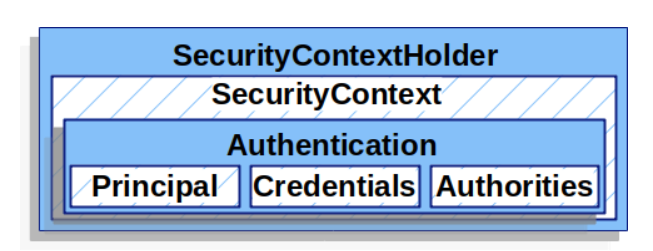
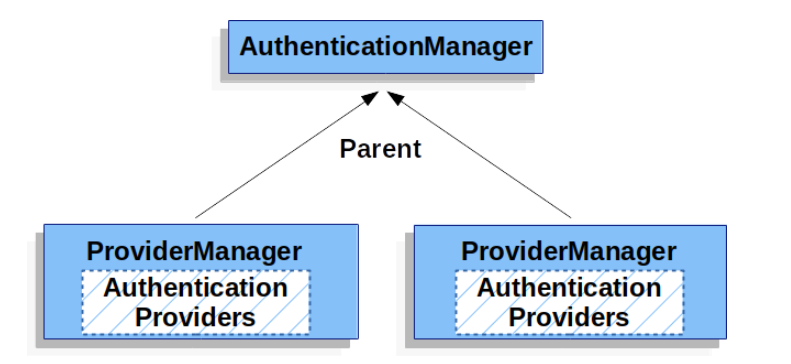

0_1_架構介紹的是spring security使用filter檢查每一個request，並且決定是否要開始進入驗證的流程，而這一小節則是要整理驗證的過程。

## SecurityContextHolder - 驗證通過後將Authentication設定在其中
整個spring security 驗證模型的核心，是spring security儲存已經驗證過的人的資料，能夠儲存現在這個執行緒的使用者資料 (Principle)，spring security不在乎SecurityContextHolder是怎麼被佈署的(被怎樣創立和給值)，只要有值，就會被認為是最近的通過驗證的使用者(該執行緒)。因此要讓使用者視為已通過驗證，最簡單的方式就是直接設定SecurityContextHolder。

結構如下圖。SecurityContextHolder 的預設是ThreadLocal。

## SecurityContext
SecurityContext 擁有一個Authentication物件。
## Authentication 
有兩個主要目的:
* 傳入AuthenticationManager並提供使用者的credentials (通常是密碼)
* 提供目前的執行緒的使用者資料。
擁有的資料:
* principal - 識別使用者的物件，代表一位使用者。若使用帳號密碼驗證，則此物件通常是UserDetail。
* credentials　－通常是密碼。在驗證通過後通常都會移除避免外洩。
* authorities　－權限， 由Authentication.getAuthorities()回傳 GrantedAuthoritys集合。GrantedAuthoritys是用來給予principal權限，相關設定可以參考authorities章節。若使用帳號密碼驗證，UserDetailsService 負責提供GrantedAuthoritys。

## AuthenticationManager and ProviderManager
AuthenticationManager 是 Spring Security的API，負責定義該如何驗證。在實現API的物件當中，ProviderManager是最常見的物件，負責調用AuthenticationProviders集合。
ProviderManager 也可以設定Parent AuthenticationManager，當沒有AuthenticationProvider可以提供驗證流程時，Parent AuthenticationManager 就能夠提供驗證方法，很多時候多個ProviderManager會設定相同的Parent AuthenticationManager ，因為可能有多個SecurityFilterChain 物件會使用相同的驗證方法。

**移除credentials**
ProviderManager預設會把從Authentication拿到的credentials移除，避免資料外洩，但若Authentication含有做為快取的物件參考，當移除credentials時，快取就擁有沒有值可以使用，因此有兩個解決辦法，第一個是在實現快取的物件或是AuthenticationProvider中直接複製Authentication，第二個則是將eraseCredentialsAfterAuthentication設定為disable。

## AuthenticationProvider 
多個AuthenticationProviders可以被注入到ProviderManager中，每一個AuthenticationProvider提供不同的驗證方法，例如 DaoAuthenticationProvider提供帳號密碼驗證， JwtAuthenticationProvider提供JWT token 驗證。

## AbstractAuthenticationProcessingFilter 
主要用來處理瀏覽器中HTTP的驗證請求，裡面包含驗證過程(Process)、驗證通過和驗證失敗的處理、Event Publication。
會從HttpServletRequest裡面拿出
1. 當有請求要求驗證時，AbstractAuthenticationProcessingFilter會從HttpServletRequest當中創立一個 Authentication物件。Authentication物件的類別是由AbstractAuthenticationProcessingFilter的子類別決定，例如:UsernamePasswordAuthenticationFilter會產出由username和password 建立的UsernamePasswordAuthenticationToken，自定義的Authentication子類別也是從AbstractAuthenticationProcessingFilter設定。
2. Authentication傳入AuthenticationManager並開始驗證流程
3. 如果失敗
   * 則 SecurityContextHolder被清掉
   * RememberMeServices.loginFail開始執行(若remember me 沒有設定則不會執行)
   * AuthenticationFailureHandler開始執行
4. 如果成功
   * 則SessionAuthenticationStrategy被通知有一個新的登入
   * Authentication設定在SecurityContextHolder，之後SecurityContextPersistenceFilter 會將SecurityContext存在HttpSession
   * 若有設定remember me則執行RememberMeServices.loginSuccess
   * ApplicationEventPublisher推出一個InteractiveAuthenticationSuccessEvent
   * 執行AuthenticationSuccessHandler。

https://docs.spring.io/spring-security/site/docs/current/reference/html5/#servlet-authentication-abstractprocessingfilter

參考網址
https://docs.spring.io/spring-security/site/docs/current/reference/html5/#servlet-authentication-authentication