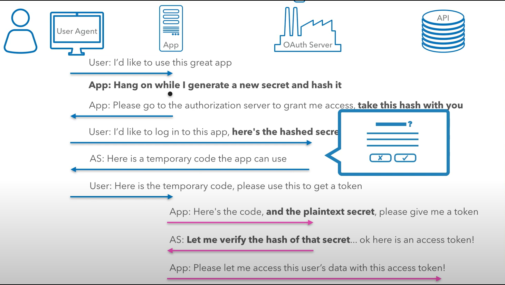

# 介紹
spring OAuth2介紹
https://www.tpisoftware.com/tpu/articleDetails/957

## Resource Owner
end-user，資料的擁有者，例如chiungjuCheng就擁有其github的repository和資料，chiungjuCheng就是那些資料的Resource Owner。

## Authorization Server
負責驗證並回傳token的server

## Resouorce server
存放使用者資料，讀取合法的token後就把資料回傳回去。

## Client Application
將使用者導去驗證頁面

## OAuth2 流程圖

## Scope
允許應用程式擁有限制權限的access token

來源:
https://www.youtube.com/watch?v=PfvSD6MmEmQ

## Spring Security OAuth2.0
在spring security的OAuth2.0框架中，提供OAuth_2.0 login、OAuth_2.0 Client和OAuth_2.0 server。

* OAuth_2.0 login 單純提供OAuth2.0登入，登入驗證完後
* 

Oauth2.0 講解影片
https://www.youtube.com/watch?v=PfvSD6MmEmQ

spring 官網範例
https://spring.io/guides/tutorials/spring-boot-oauth2/

spring sample範例
https://github.com/spring-projects/spring-security-samples/tree/5.5.x/servlet/spring-boot/java/oauth2/login#github-login

建立oauth2 login
https://github.com/spring-projects/spring-security-samples/tree/5.5.x/servlet/spring-boot/java/oauth2/login#google-initial-setup

整合Oauth2和resource server
https://www.baeldung.com/spring-security-oauth2-jws-jwk