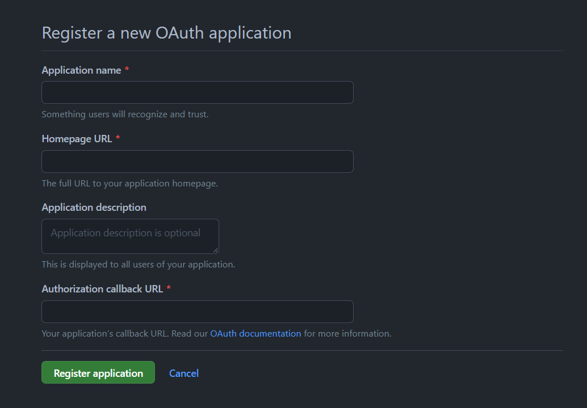

# 設定
## 設定pom.xml
在pom.xml放上需要的dependency，加上這個spring就會把OAuth 2.0做為default
```xml
<!-- Oauth2-->
<dependency>
    <groupId>org.springframework.boot</groupId>
	<artifactId>spring-boot-starter-oauth2-client</artifactId>
</dependency>
```

## 在GitHub申請clientId和clientSecret
進入以下網址，可以註冊一個新的OAuth application
https://github.com/settings/applications/new




# 

